---

<h2 align="center">👩‍💻 The Dev Behind the Code</h2>

🎯 Frontend Developer specialized in **Angular 18+** and **React.js**, with a Full Stack layer built on **Node.js** and **Express**.

Clean, maintainable code and **SOLID principles** are non-negotiable — every project is built to be read and extended by someone else, not just to work. Most of the work lives at the intersection of frontend polish and real-time systems: **REST APIs, WebSockets, and live data flows** that actually hold up under bad network conditions.

**Currently Focused On:**

🏙️ Real-time dashboards powered by WebSocket & Socket.io

🎨 Scalable, reusable UI components across Angular & React

🔗 End-to-end integration with Node.js & Express backends

🤖 AI tools & prompt engineering to build faster, smarter

---

## 🚀 Tech Stack

### Languages

### Frontend

### Styling

### Backend

### Tools

---

## 📊 GitHub Stats

---

## 🎓 Education

**Bachelor of Engineering — Systems & Computer Engineering** (2021–2026)
**Al-Azhar University, Cairo**

---

## 📫 Connect with Me

